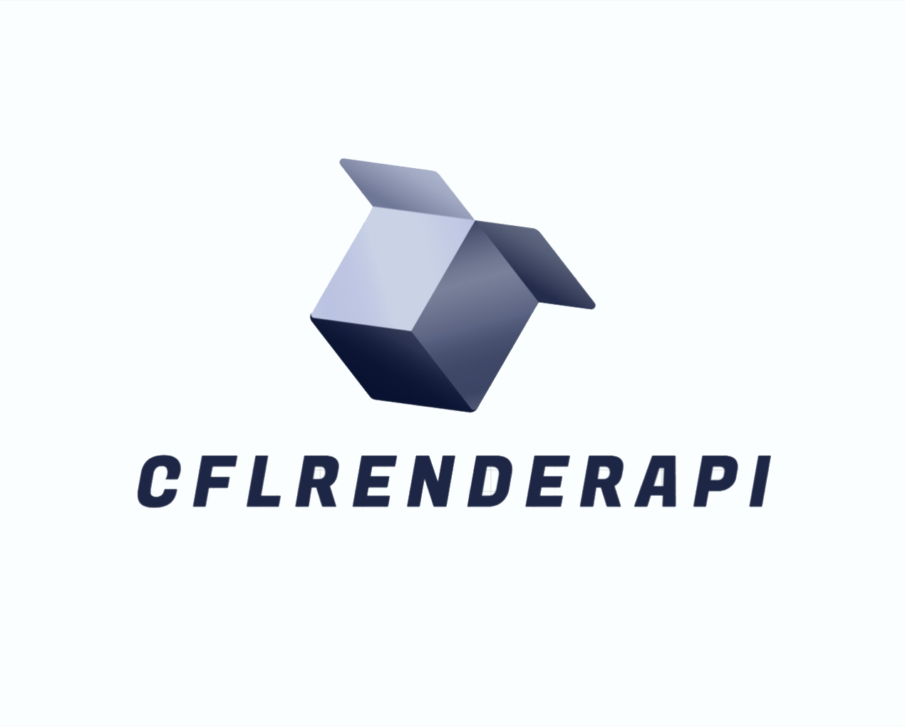

项目地址：
## GitHub : [https://github.com/cfl997/CFLRenderAPI](https://github.com/cfl997/CFLRenderAPI)
## 项目概述

CFLRenderAPI 是一个跨平台的渲染引擎，旨在为上层应用提供统一的API接口，支持OpenGL和DirectX两种渲染后端。通过动态加载库的方式，上层应用可以切换不同的渲染引擎。

支持多任务多线程。使渲染层和分离。


## 项目结构

- **RenderAPI**: 对外暴露的接口模块，定义了上层应用与渲染引擎的交互接口。
- **RenderGL**: OpenGL渲染模块，实现了基于OpenGL的渲染功能。
- **RenderDX**: DirectX渲染模块，实现了基于DirectX的渲染功能。
- **上层应用**: 通过调用`RenderAPI`提供的接口，使用不同的渲染引擎进行渲染。

## 构建与配置

### CMake 配置

项目使用CMake进行构建，支持`Debug`和`Release`两种构建模式。可以通过以下命令指定构建类型：

```bash
cmake -DCMAKE_BUILD_TYPE=Debug ..
```

或

```bash
cmake -DCMAKE_BUILD_TYPE=Release ..
```

### 第三方库依赖

项目依赖以下第三方库：

- **freetype-2.13.0**: 用于字体渲染。
- **glew-2.2.0**: OpenGL扩展库，用于加载OpenGL扩展函数。
- **glfw-3.4**: 用于创建窗口和处理输入事件。
- **glm-1.0.1**: OpenGL数学库，用于矩阵和向量计算。
- **gTest**: Google Test框架，用于单元测试。
- **stb_image.h**: 用于图像加载。
- **stb_image_write.h**: 用于图像保存。

## 使用说明

### 1. 克隆项目

首先，克隆项目到本地：

```bash
git clone https://github.com/cfl997/CFLRenderAPI.git
cd CFLRenderAPI
```

### 2. 配置CMake

在项目根目录下创建`build`文件夹，并配置CMake：

```bash
mkdir build
cd build
cmake -DCMAKE_BUILD_TYPE=Debug ..
```

### 3. 编译项目

使用以下命令编译项目：

```bash
make
```

### 4. 运行示例

编译完成后，可以在`build`目录下找到生成的可执行文件。运行GTest程序：

```bash
待做
```

## API 接口

### RenderAPI 接口

`RenderAPI`模块提供了关于OpenGL的所有接口：

- **CFLRenderGL_Init()**: 初始化渲染引擎。
- **CFLRenderGL_CreateContext()**: 执行渲染操作。
- **CFLRenderGL_ReleaseContext()**: 关闭渲染引擎，释放资源。


## 贡献指南

我们欢迎任何形式的贡献！如果你有兴趣为CFLRenderAPI项目做出贡献，请遵循以下步骤：

1. **Fork 项目**: 在GitHub上Fork本项目。
2. **创建分支**: 创建一个新的分支用于开发。
3. **提交更改**: 在分支上进行开发，并提交更改。
4. **创建Pull Request**: 向主仓库提交Pull Request，描述你的更改。

## 许可证

CFLRenderAPI 项目采用 [MIT 许可证](LICENSE)。

## 联系方式

如果你有任何问题或建议，请通过以下方式联系我们：

- **GitHub Issues**: [https://github.com/cfl997/CFLRenderAPI/issues](https://github.com/cfl997/CFLRenderAPI/issues)
- **Email**: [cfl997@163.com](mailto:cfl997@163.com)

---

感谢你对CFLRenderAPI项目的关注与支持！我们期待你的贡献与反馈。